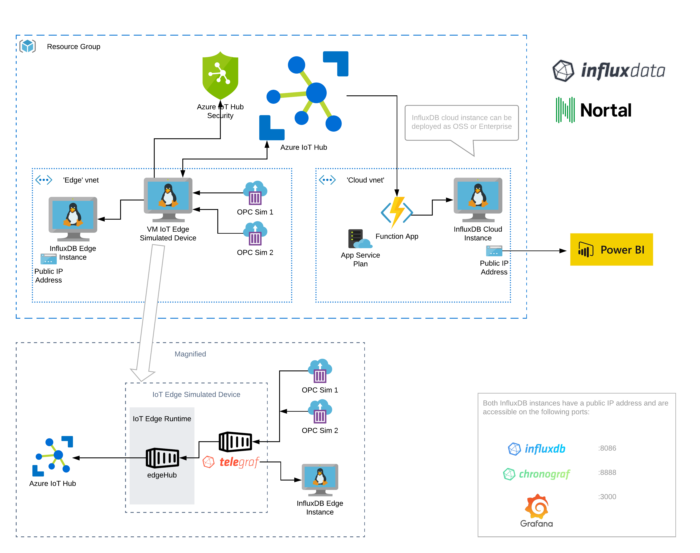

# Overview

This repository will create resources in Azure for an InfluxDB solution accelerator and various Azure resources to demonstrate capability of using InfluxDB in the context of Azure IoT Hub and Azure IoT Edge.

## Requirements

* Valid Azure account 
* Permissions to deploy the necessary resources

## How To Deploy

The simplest way to deploy this solution accelerator is to navigate to the 'deploy' directory and click the "Deploy to Azure" button in the README document. This button will redirect you to the Azure portal with the necessary ARM template prepared.

## Post-Deployment Configuration

If InfluxDB Enterprise is selected there is an additional post-deployment step to configure the Azure Function. 

* Identify the InfluxDB Cloud load balancer in your resource group.
* Get the public IP address of the load balancer.
* Navigate to the Azure function.
* Modify the settings/configuration of the Site.
* Update the INFLUX_HOST environment variable to public IP address of the load balancer.

For Open Source deployments this is set automatically.

Additionally, provided in the powerbi directory, is a sample Power BI dashboard which, when opened, will prompt for a public IP address to an Influx DB host. To use this dashboard, input the Public IP address of either your cloud or edge InfluxDB instance. Data will then be gathered directly from the InfluxDB time series Database.

# ARM Template

The ARM templates for this Solution Accelerator deployment are located in the 'deploy' directory. The sub-directories within contain ARM templates for specific components of this deployment. The main 'deploy.json' file is the parent deployment which pulls these components together.

## Parameters

When redirected to the Azure Portal to deploy this Solution Accelerator you will be prompted to enter some information to customize your deployment. Those parameters are:

<table>
    <tr>
        <th>Parameter</td>
        <th>Type</th>
        <th>Description</th>
    </tr>
    <tr>
        <td>name</td>
        <td>string</td>
        <td>Short identifier for the environment.</td>
    </tr>
    <tr>
        <td>environment</td>
        <td>string</td>
        <td>Environment type: test, dev, qa. Forms second part of the identifier.</td>
    </tr>
    <tr>
        <td>location</td>
        <td>string</td>
        <td>Azure location to use for the cloud components of the deployment.</td>
    </tr>
    <tr>
        <td>edge location</td>
        <td>string</td>
        <td>Azure location to use for the edge components of the deployment. This <b><u>can</u></b> be the same as the cloud location.</td>
    </tr>
    <tr>
        <td>VM admin username</td>
        <td>string</td>
        <td>Username to setup on deployed virtual machines.</td>
    </tr>
    <tr>
        <td>VM admin password</td>
        <td>string</td>
        <td>Password to setup for the above user.</td>
    </tr>
    <tr>
        <td>base VM size</td>
        <td>string</td>
        <td>Azure VM size to use for all deployed virtual machines. Defaults to <code>Standard_B1ms</code>.</td>
    </tr>
    <tr>
        <td>influxdb option</td>
        <td>string</td>
        <td>Either <code>Open Source</code> or <code>Enterprise</code>*. Enterprise deployments will deploy a highly available Enterprise version of InfluxDB among the cloud assets. Open Source deployments will deploy a single instance of InfluxDB among the cloud assets.</td>
    </tr>
</table>

**\*there will be an additional post-deployment configuration step for Enterprise deployments. See above.**

# What is Deployed?

The deployment is centered around an instance of Azure IoT Hub. Data is generated by two Azure container instances functioning as PLC simulators. A VM is deployed to an edge network and configured to simulate an IoT Edge device, connecting back up to the Azure IoT Hub. A deployment of InfluxData's Telegraf is deployed to the edge device and connects to the PLC simulators using the OPC UA protocol. Data is read from the PLC simulators by Telegraf and then output to Azure IoT Hub and to a separate edge instance of InfluxDB. The messages fed into IoT Hub trigger an Azure Function to write the message to a cloud instance of InfluxDB. See diagram below.

